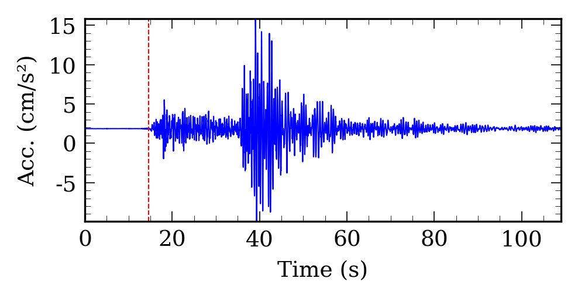
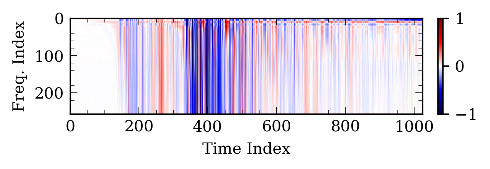
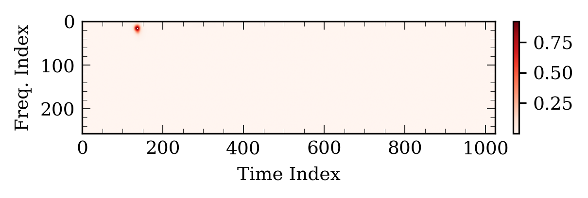

# SMR-DP

[](https://doi.org/10.1785/0320260007)
[](https://doi.org/10.5281/zenodo.18396601)
[](https://www.python.org/)
[](https://pytorch.org/)

**Automated strong-motion record processing via deep learning-based simultaneous
P-wave identification and high-pass corner-frequency selection.**

This repository accompanies:

> Inocente, I., and Maruyama, Y. (2026). Automated Strong-Motion Record
> Processing via Deep Learning-Based Simultaneous P-Wave Identification and
> High-Pass Corner-Frequency Selection. *The Seismic Record*, 6(2), 219-229.
> https://doi.org/10.1785/0320260007

SMR-DP converts strong-motion acceleration records into displacement-frequency
matrices across candidate high-pass corner frequencies (`fcHP`) and uses a
segmentation model to localize both the P-wave arrival time (`tP`) and the
recommended `fcHP`. The workflow is designed for reproducible research,
publication figures, and rapid testing on new records.

## Highlights

- Jointly estimates `tP` and `fcHP` as a single image-localization problem.
- Builds 256 x 1024 displacement-frequency matrices from candidate `fcHP`
  values between 0.005 and 1.28 Hz.
- Provides a pretrained DeepLabV3+ model with an EfficientNet-B3 encoder.
- Includes a sample strong-motion record and scripts for inference, plotting,
  and timing experiments.
- Uses a small Fortran core for fast acceleration integration and displacement
  differentiation.

## Repository Layout

```text
.
├── core/                  # Fortran numerical kernels; build processing.so locally
├── data/                  # Small sample input only; large datasets stay external
├── docker/                # Container build for reproducible environments
├── docs/                  # Method, data, model, and reproducibility notes
├── examples/              # Minimal user-facing examples
├── img/                   # Example output figures used in the README/docs
├── models/                # Pretrained model checkpoint
├── scripts/               # Runnable demos and benchmark utilities
└── src/                   # Matrix generation, signal processing, model, plots
```

## Quick Start

Install Python dependencies:

```bash
python3 -m venv .venv
source .venv/bin/activate
python3 -m pip install --upgrade pip
python3 -m pip install -r requirements.txt
```

Compile the Fortran processing library:

```bash
make core
```

Run the bundled sample record:

```bash
python3 scripts/test_matrix.py demo --trace-index 3 --save-figures
```

The command reads `data/20260106101800s.pickle`, builds the
displacement-frequency matrix, runs model inference, estimates `tP`, and writes
updated figures to `img/`.

## Example Outputs

The demo produces the three diagnostic views below.

| Input acceleration | Displacement-frequency matrix | Model prediction |
| --- | --- | --- |
|  |  |  |

## Scientific Workflow

1. Read an acceleration trace with ObsPy.
2. Apply baseline correction, tapering, band-pass filtering, integration, and
   optional polynomial displacement detrending.
3. Repeat processing across the `fcHP` grid and resample each displacement
   trace to a common time axis.
4. Stack the normalized displacement traces into a 256 x 1024
   displacement-frequency matrix.
5. Run the DeepLabV3+ model to obtain a probability heatmap.
6. Post-process the heatmap with a Gaussian local maximum to estimate the
   matrix coordinate corresponding to `tP` and `fcHP`.

More details are in [docs/method.md](docs/method.md).

## Data and Model Files

This repository intentionally includes only lightweight demonstration assets:

- `data/20260106101800s.pickle`: sample ObsPy-readable stream for the demo.
- `models/HP_DeepLabV3Plus/best_model.pt`: pretrained checkpoint used by
  `src/model.py`.
- `img/*.png`: example outputs generated from the sample workflow.

The full research dataset is not stored in Git. The paper reports 2380
three-component records from K-NET and KiK-net with an earthquake-level split.
See [docs/data.md](docs/data.md) for data organization notes and what should be
documented before a public archival release.

The reference label tables used in the paper are archived on Zenodo:

> Inocente, I. (2026). Reference tP and fcHP labels with earthquake-level splits
> (K-NET/KiK-net) [Dataset]. Zenodo.
> https://doi.org/10.5281/zenodo.18396601

The Zenodo release contains the train, validation, and test CSV files with
record identifiers and reference `tP`/`fcHP` labels. The versioned dataset DOI is
`10.5281/zenodo.18396601`; the all-versions concept DOI is
`10.5281/zenodo.18396600`.

## Docker

Build the container from the repository root:

```bash
docker build -f docker/Dockerfile -t smr-dp .
```

Run the demo:

```bash
docker run --rm -it smr-dp
```

If you mount your local checkout into the container, rebuild the native library
inside the mounted workspace:

```bash
docker run --rm -it -v "$PWD:/workspace" smr-dp \
  bash -lc "make core && python3 scripts/test_matrix.py demo --trace-index 3 --save-figures"
```

## Citation

If this repository helps your work, please cite the paper:

```bibtex
@article{inocente2026smrdp,
  title = {Automated Strong-Motion Record Processing via Deep Learning-Based Simultaneous P-Wave Identification and High-Pass Corner-Frequency Selection},
  author = {Inocente, Italo and Maruyama, Yoshihisa},
  journal = {The Seismic Record},
  volume = {6},
  number = {2},
  pages = {219--229},
  year = {2026},
  doi = {10.1785/0320260007}
}
```

Dataset citation:

```bibtex
@dataset{inocente2026smrdp_dataset,
  title = {Reference tP and fcHP labels with earthquake-level splits (K-NET/KiK-net)},
  author = {Inocente, Italo},
  publisher = {Zenodo},
  year = {2026},
  doi = {10.5281/zenodo.18396601}
}
```

GitHub-compatible citation metadata is also provided in [CITATION.cff](CITATION.cff).
